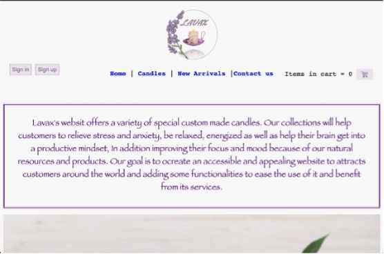
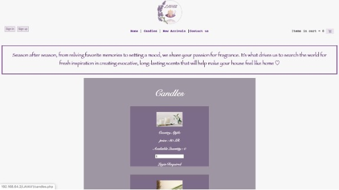
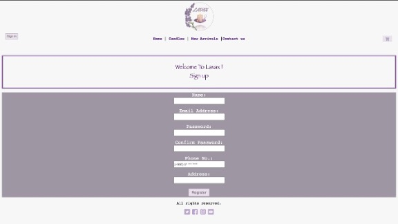

# LAVAX_website
A dummy website using HTML, CSS, PHP and JavaScript.  Lavax is user-friendly website for shopping which offers a variety of special candles .

## Table of contents
- [Lavax website](#LAVAX_website)
  - [Table of contents](#table-of-contents)
  - [Screenshots](#screenshots)
  - [Technologies](#technologies)
  - [Features](#features)
  - [Status](#status)
  - [Inspiration](#inspiration)

## Screenshots
Some screenshots for the website

## Technologies
* HTML
* CSS
* PHP
* JavaScript

## Features
Online candle shop website.
## Status
Project is: _completed_.

## Inspiration
Project for Foundations of declarative programming in HTML, CSS, PHP, and JavaScript.
